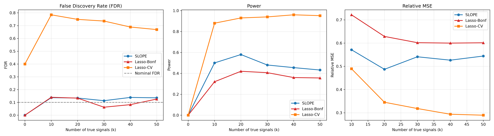
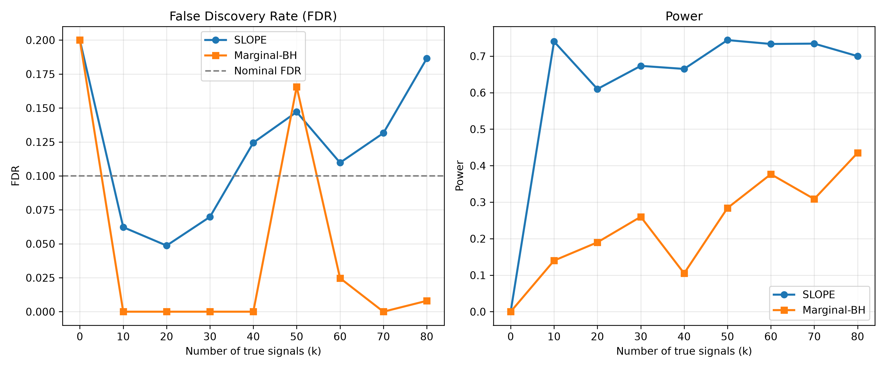
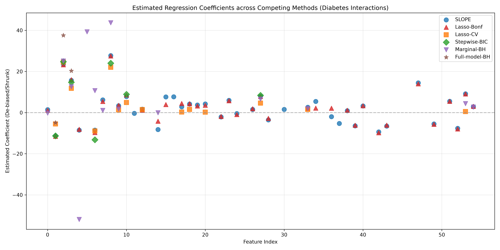

<div align="center">

# SLOPE

### Sorted L-One Penalized Estimation

*Python reference implementation · Bogdan et al. (2015)*

[](https://www.python.org/)
[](tests/test_slope.py)
[](LICENSE)

</div>

---

Reproduces the simulations and benchmark from:

> Bogdan, M., van den Berg, E., Sabatti, C., Su, W., & Candès, E. J. (2015).
> *SLOPE — Adaptive Variable Selection via Convex Optimization.*
> **The Annals of Applied Statistics**, 9(3), 1103–1140.

---

## The estimator

SLOPE minimizes a sorted-L1-penalized least squares objective:

$$\hat{\beta} = \arg\min_{b \in \mathbb{R}^p} \frac{1}{2}\|y - Xb\|_2^2 + \sum_{i=1}^p \lambda_i \lvert b \rvert_{(i)}$$

where $\lvert b \rvert_{(1)} \ge \cdots \ge \lvert b \rvert_{(p)}$ are the sorted absolute coefficients and $\lambda_1 \ge \cdots \ge \lambda_p \ge 0$ is a non-increasing penalty sequence that controls the **False Discovery Rate**.

### Penalty sequences

**Benjamini–Hochberg** (orthogonal designs):

$$\lambda_{\mathrm{BH}}(i) = \sigma\,\Phi^{-1}\!\left(1 - \frac{iq}{2p}\right)$$

**Gaussian-adjusted** $\lambda_G^*$ (correlated / Gaussian designs): inflates $\lambda_{\mathrm{BH}}$ recursively by a Wishart correction factor,

$$\lambda_G(i) = \lambda_{\mathrm{BH}}(i)\sqrt{1 + \frac{1}{n-i}\sum_{j < i}\lambda_G(j)^2}$$

then flattens at the global minimum $k^*$ to preserve convexity:

$$\lambda_G^*(i) = \lambda_G\!\left(\min(i,\, k^*)\right)$$

---

## Algorithms

| Function | Ref | Description |
|:---|:---:|:---|
| `fast_prox_sl1` | Alg. 4 | PAV proximal operator for sorted-L1, $O(p)$ after sort |
| `fista_slope` | Alg. 2 | FISTA accelerated proximal gradient solver |
| `scaled_slope` | Alg. 5 | Iterative SLOPE with unknown $\sigma$ |
| `lambda_bh` | § 2 | Benjamini–Hochberg penalty sequence |
| `lambda_g_star` | § 3.2.2 | Gaussian-adjusted penalty sequence |
| `lambda_mc` | § 3.2.2 | Monte Carlo adjusted sequence |

---

## Repository

```
slope/
└── solvers.py              all algorithms and penalty sequences

simulations/
├── simulation_1.py         § 1.3.3 — FDR / Power / MSE comparison
└── simulation_2.py         § 3.1   — equicorrelated noise

real_data/
└── real_data_analysis.py   diabetes interactions benchmark (n=442, p=55)

tests/
└── test_slope.py           unit tests

run_all.py                  run everything
```

---

## Quick start

> **Requirements:** Python 3.9+, [`uv`](https://github.com/astral-sh/uv)

```bash
git clone https://github.com/rkmishra1/SLOPE.git
cd SLOPE
pip install -e .
uv run --with numpy --with scipy python -m unittest discover -s tests
```

**Run all experiments:**

```bash
# fast mode  (~10 s · 5 replicates)
uv run --with numpy --with scipy --with matplotlib --with scikit-learn --with pandas \
    python run_all.py --mode fast

# full mode  (~5 min · 100 replicates)
uv run --with numpy --with scipy --with matplotlib --with scikit-learn --with pandas \
    python run_all.py --mode full
```

---

## Results

### Simulation 1 — FDR / Power / MSE

At target $q = 0.1$, SLOPE (de-biased) is the only method that simultaneously controls FDR, achieves high power, and attains the lowest relative MSE. Lasso-Bonferroni is overly conservative; Lasso-CV inflates FDR to ~80%.

<p align="center"></p>

### Simulation 2 — Equicorrelated noise

Whitened SLOPE exploits the covariance structure for higher power and stable FDR control. Marginal BH is conservative with high variance in false discovery proportion.

<p align="center"></p>

### Real data — Diabetes interactions

$n = 442,\; p = 55$ pairwise interaction features.

| Method | Selected vars | $R^2$ | $\hat{\sigma}$ |
|:---|:---:|:---:|:---:|
| **SLOPE** | **41** | **0.5761** | 52.70 |
| Lasso-Bonf | 37 | 0.5748 | 53.11 |
| Lasso-CV | 14 | 0.5301 | — |
| Stepwise-BIC | 7 | 0.5340 | — |
| Marginal-BH | 14 | 0.5183 | — |
| Full-model-BH | 3 | 0.3998 | 53.11 |

<p align="center"></p>
